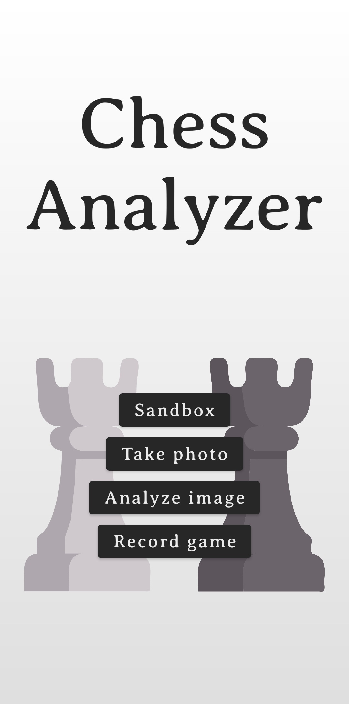
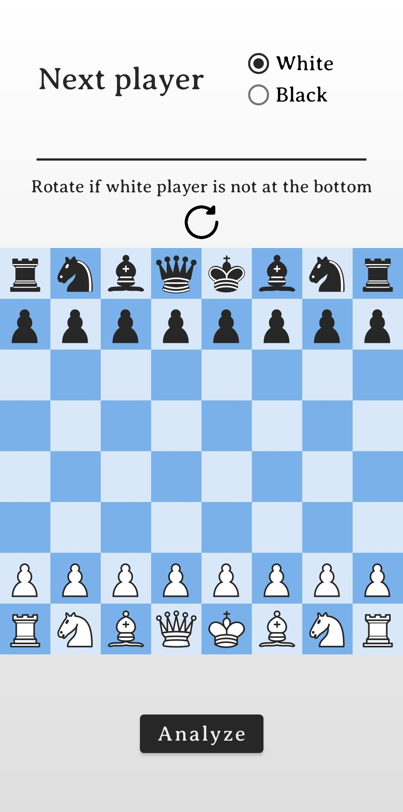
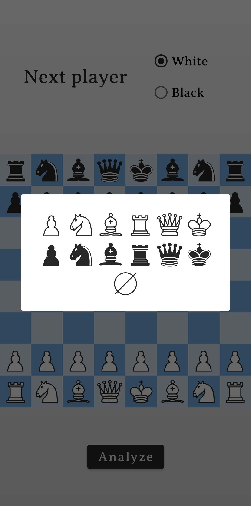
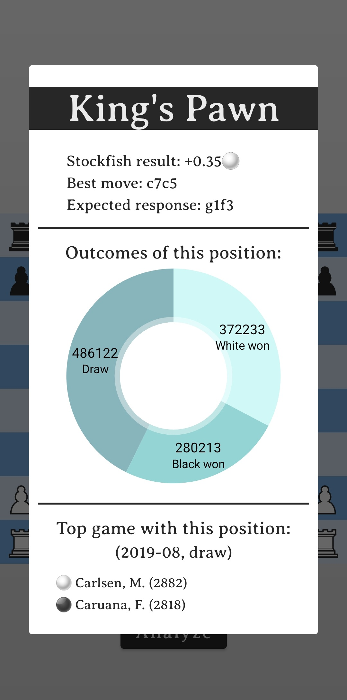

# Gépi látáson alapuló sakkelemző alkalmazás

Itt találhatóak a Chess Analyzer alkalmazás fájljai, valamint a *screen_recording.mp4* videó, amely a program sakkjátszmák lejegyzését végző funkcióját mutatja működés közben.

# Chess Analyzer

An Android app that uses computer vision to localize a chessboard
and recognize pieces from an image, using OpenCV for board detection
and a self-trained TFLite model for piece classification. Recognized
positions are evaluated by the integrated Stockfish engine and queried
against the Lichess API for opening and position data. The app can
also continuously monitor a physical game and transcribe moves into
standard chess notation.

  
  
  
  
  

## Features

- ♟️ Automatic chessboard detection using OpenCV
- 🤖 Piece recognition with a custom-trained TensorFlow Lite model
- 📸 Position extraction from images and camera input
- 🧠 Integrated Stockfish engine for position evaluation
- 📚 Opening and position stats via Lichess API
- 🔄 Real-time game tracking and move transcription
- 📝 Export of moves in standard chess notation (SAN)
